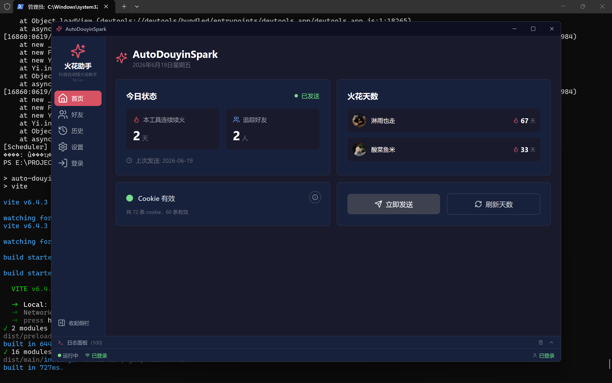
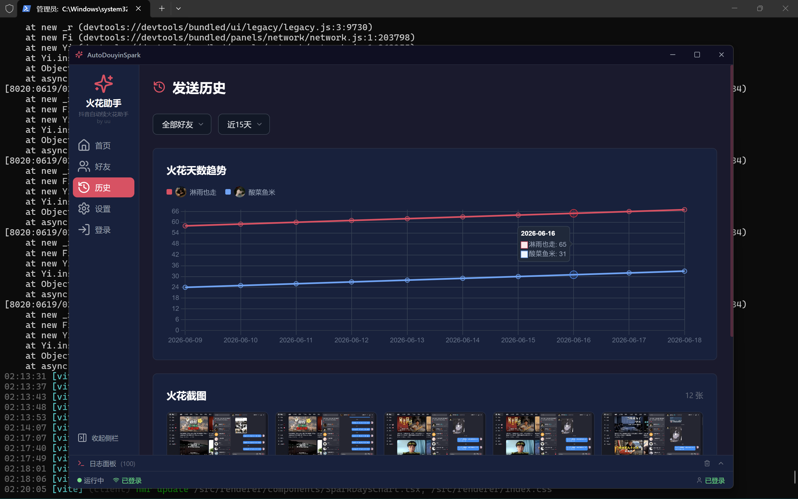
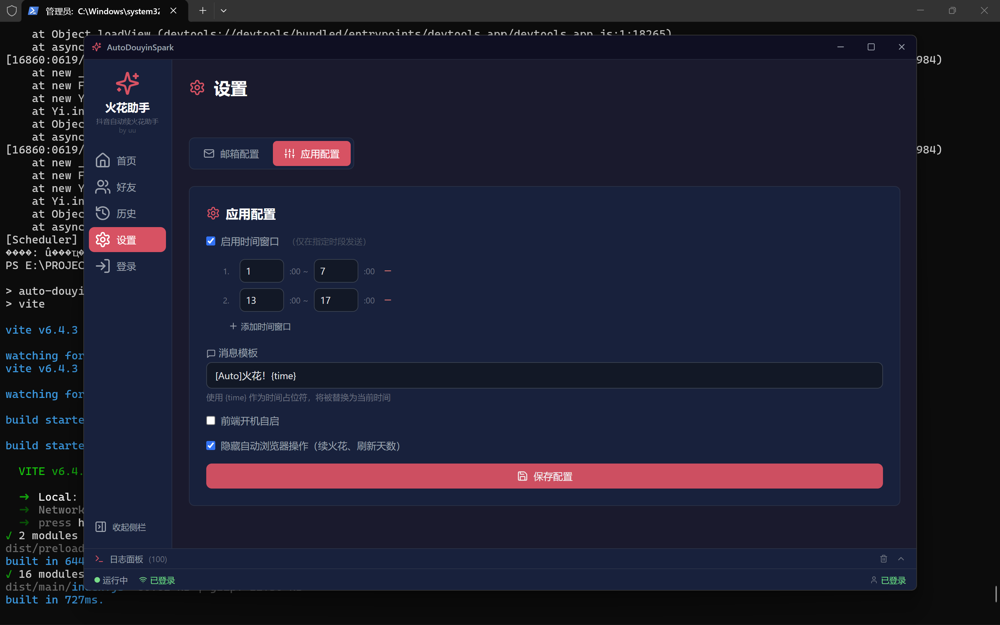

# AutoDouyinSpark v2.2

抖音自动续火花助手 — Electron 桌面端。  
通过 Playwright + Cookie 登录，每天自动向好友发送续火花消息，支持 Web 可视化控制面板。

🌐 **官网**: [https://www.uu233.xyz/](https://www.uu233.xyz/)

## 截图





## 功能

- **自动续火花** — 每天凌晨/傍晚自动向指定好友发送消息
- **Web 控制面板** — Electron 桌面应用，可视化操作
- **好友管理** — 添加/删除目标好友
- **发送历史** — 火花天数趋势折线图、截图回放
- **Cookie 管理** — 扫码登录 / 导入 Cookie，检测有效期
- **邮件提醒** — Cookie 过期前自动发邮件通知
- **调度器** — 内置定时任务，支持时间窗口配置
- **无头模式** — 可选择隐藏浏览器后台运行

## 下载安装

> 💡 如果你只想直接使用，**不需要自己编译**，请从 GitHub Releases 下载安装包：

[⬇️ 下载 AutoDouyinSpark Setup 2.1.0.exe](https://github.com/baiyingawa/AutoDouyinSpark/releases/tag/v2.1.0)

- 下载后双击安装，按提示完成安装
- 安装后桌面会生成「AutoDouyinSpark」快捷方式
- 首次启动请扫码登录抖音账号

---

## 快速开始

以下方式适用于开发/调试：

```bash
# 1. 安装依赖
cd electron-app
npm install

# 2. 确保 Playwright 已安装
pip install playwright
playwright install chromium

# 3. 启动
npm run dev
```

## 使用说明

### 首次使用

1. 启动后进入登录页 → 扫码登录抖音
2. 登录成功后 Cookie 自动保存
3. 进入好友页 → 添加需要续火花的好友

### 续火花

- 主页点击「立即发送」手动触发
- 或等待调度器在时间窗口（1:00~7:00 / 17:00~19:00）自动执行
- 每次发送后自动截图存档

### Cookie 过期

- Cookie 约 1~2 月过期
- 过期后主页会显示「Cookie 无效」，点击「重新登录」扫码
- 或通过「导入 Cookie」粘贴 Cookie-Editor 导出的 JSON

## 技术栈

| 层 | 技术 |
|---|------|
| 前端 | React 18 + TypeScript + Tailwind CSS + Lucide |
| 桌面壳 | Electron 33 |
| 构建 | Vite 6 + vite-plugin-electron |
| 自动化 | Python 3.10 + Playwright |
| 图表 | Chart.js (react-chartjs-2) |

## 项目结构

```
AutoDouyinSpark/
├── douyin_spark.py              # Python 火花发送核心
├── email_alert.py               # Cookie 过期邮件提醒
├── electron-app/                # Electron 桌面应用
│   ├── src/
│   │   ├── main/                # 主进程（IPC、调度器）
│   │   ├── renderer/            # 渲染进程（React UI）
│   │   └── preload/             # 预加载桥接
│   └── python/                  # Python 引擎
│       ├── engine.py            # CLI 统一入口
│       ├── login_helper.py      # 扫码登录
│       └── email_alert.py       # 邮件提醒
├── spark_config.json            # 用户配置
└── screenshots/                 # 发送截图存档
```

## 配置

### spark_config.json

```json
{
  "target_users": ["好友A", "好友B"],
  "message_template": "[Auto]火花火花！{time}",
  "morningStart": 1,
  "morningEnd": 7,
  "eveningStart": 17,
  "eveningEnd": 19,
  "hideBrowser": true
}
```

## 版本历史

| 日期 | 版本 | 说明 |
|------|------|------|
| 2026-06-19 | v2.1 | 头像抓取、强制发送、系统托盘、自动更新、应用图标 |
| 2026-06-18 | v2.0 | Electron 桌面端重构，Web 控制面板、好友管理、历史图表、扫码登录、调度器 |
| 2026-05-28 | v0.2 | 新增 Cookie 过期邮件提醒、Flask Web 控制面板 |
| 2026-05-27 | v0.1 | 初版 CLI 脚本，自动发消息 |
